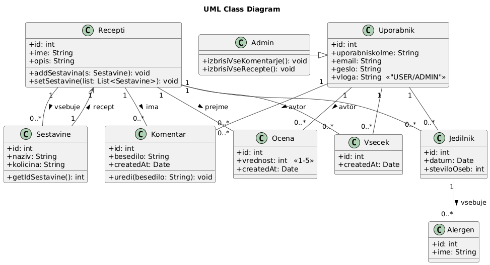

# Razredni diagram (UML) — RIS-Recepti

Spodaj je vključen razredni (class) diagram, ki prikazuje osnovne razrede sistema za upravljanje receptov in njihove glavne zveze.

Kratek opis razrednega diagrama (vloga razredov in ključne metode)
-----------------------------------------------------------------

- Recepti
    - Namen/vloga: Predstavlja posamezen recept (entiteto, ki združuje ime, opis in sestavine).
    - Ključni atributi: `id: int`, `ime: String`, `opis: String`
    - Ključne metode:
        - `addSestavina(s: Sestavine): void` — doda eno sestavino v recept; poskrbi za vzpostavitev povezave med receptom in sestavino ter preveri podvajanja.
        - `setSestavine(list: List<Sestavine>): void` — nastavi/posodobi celoten seznam sestavin pri urejanju recepta.
    - Dodatno: Recept je avtorjev (Uporabnik) in je lahko povezan s komentarji, ocenami in všečki.

- Sestavine
    - Namen/vloga: Predstavlja sestavino, uporabljeno v receptu, z imenom in količino.
    - Ključni atributi: `id: int`, `naziv: String`, `kolicina: String`
    - Ključne metode:
        - `getIdSestavine(): int` — vrne identifikator sestavine.
    - Dodatno: Sestavine so del kompozicije recepta (1 recept vsebuje 0..* sestavin).

- Komentar
    - Namen/vloga: Predstavlja komentar uporabnika o receptu.
    - Ključni atributi: `id: int`, `besedilo: String`, `createdAt: Date`
    - Ključne metode:
        - `uredi(besedilo: String): void` — omogoči urejanje besedila komentarja (z ustreznimi preverjanji avtorizacije/validacije).
    - Dodatno: Komentar povezuje Uporabnika (avtorja) in Recept; lahko ga ureja avtor ali admin.

- Ocena
    - Namen/vloga: Predstavlja oceno recepta (npr. lestvica 1–5).
    - Ključni atributi: `id: int`, `vrednost: int (1-5)`, `createdAt: Date`
    - Ključne metode:
        - (implicitno) `setVrednost(v: int)` in `validate()` — poskrbita, da je ocena v dopuščnem razponu in zabeleži čas ustvarjanja.
    - Dodatno: Ocene omogočajo agregacijo povratnih informacij o receptih.

- Všeček (Vsecek)
    - Namen/vloga: Predstavlja “všečkanje” ali zaznamek recepta s strani uporabnika.
    - Ključni atributi: `id: int`, `createdAt: Date`
    - Ključne metode:
        - `toggleVsecek()` ali `create()`/`remove()` — označi/odstrani všeček za danega uporabnika in recept.
    - Dodatno: Uporabniki lahko favoritizirajo recepte; razmerje med uporabnikom in receptom je 0..*.

- Jedilnik
    - Namen/vloga: Predstavlja jedilnik (npr. zbirko receptov za določen datum ali obrok).
    - Ključni atributi: `id: int`, `datum: Date`, `steviloOseb: int`
    - Ključne metode:
        - `addRecept(recept: Recepti)`, `removeRecept(receptId: int)` — upravljanje receptov v jedilniku.
    - Dodatno: Jedilnik lahko povezuje alergene (1 jedilnik vsebuje 0..* alergenov).

- Alergen
    - Namen/vloga: Predstavlja alergen (npr. gluten, oreški), ki ga je mogoče vezati na jedilnik ali sestavino.
    - Ključni atributi: `id: int`, `ime: String`
    - Ključne metode:
        - osnovne get/set metode, npr. `getIme()`.
    - Dodatno: Pomemben za filtriranje receptov ali opozarjanje uporabnikov.

- Uporabnik
    - Namen/vloga: Predstavlja uporabniški račun sistema z avtentikacijo in vlogo.
    - Ključni atributi: `id: int`, `uporabniskoIme: String`, `email: String`, `geslo: String`, `vloga: «USER/ADMIN»`
    - Ključne metode:
        - `authenticate(credentials)`, `authorize(action)` — metode za preverjanje identitete in dovoljenj.
        - `postComment(receptId, besedilo)`, `rateRecipe(receptId, vrednost)`, `createRecipe(...)` — uporabniške akcije, ki ustvarjajo komentarje, ocene in recepte.
    - Dodatno: Uporabnik je avtor receptov, komentarjev, ocen in všečkov.

- Admin
    - Namen/vloga: Posebna vloga uporabnika z razširjenimi privilegiji.
    - Relacija: v diagramu je Admin povezan/izpeljan iz Uporabnik (značilno dedovanje oz. poseben tip uporabnika z več pravicami).
    - Ključne metode:
        - `izbrisiVseKomentarje(): void` — administrativno odstrani komentarje (npr. za čiščenje).
        - `izbrisiVseRecepte(): void` — odstrani recepte iz sistema (upoštevati varnostne mehanizme in audit).
    - Dodatno: Admin lahko upravlja vsebino in uporabnike.

Povezave in multiplicitete (kratko)
- Recepti — Sestavine: 1 recept vsebuje 0..* sestavin.
- Recepti — Komentar/Ocena/Všeček: 1 recept ima 0..* komentarjev, ocen in všečkov.
- Uporabnik — (Recepti, Komentar, Ocena, Vsecek): en uporabnik lahko ustvari več receptov, komentarjev, ocen in všečkov.
- Jedilnik — Alergen: 1 jedilnik vsebuje 0..* alergenov.
